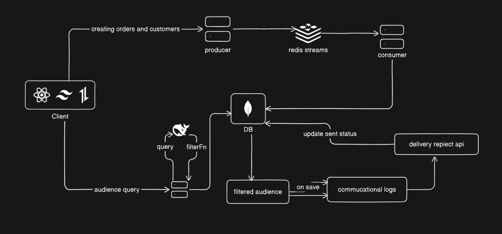

# Mini CRM Platform

A full-stack application to create personalized marketing campaigns, deliver messages to customers via a simulated vendor API, and track communication statuses in real-time.

---

## Project Overview

This system helps businesses:
- Create campaigns targeting specific customers
- Send personalized messages using a simulated vendor
- Track delivery receipts (SENT/FAILED)
- View campaign and message status logs

---

## Demo


## Local Setup Instructions

### 1. Clone the Repository
```bash
git clone https://github.com/Chetan3327/xeno
cd xeno
```

### 2. Install Dependencies (Backend and Frontend)
```bash
# Backend
cd backend
npm install

# Frontend
cd frontend
npm install
```

### 3. Set Environment Variables
Create a `.env` file inside the `backend/` folder with the following content:
```env
PORT = 
DATABASE_URL = 
GOOGLE_CLIENT_ID =
GOOGLE_CLIENT_SECRET =
JWT_SECRET =
HF_API_KEY =
BACKEND_URL =
REDIS_URL =
```
Create a `.env` file inside the `frontend/` folder with the following content:
```env
VITE_GOOGLE_CLIENT_ID = 
VITE_BACKEND_URL = 
```

### 4. Start the Application
```bash
# Start backend
cd backend
npm run dev

# Start frontend
cd frontend
npm run dev
```

Open your browser and go to: `http://localhost:5173`

---

## Architecture Diagram


---

## Summary of Tools and Technologies Used
The Tech Stack used is:

<div align="center">
  <a href="https://skillicons.dev">
      
  </a>
</div>


### Frontend
* React.js
* Tailwind CSS
* ShadCN UI
* React Router DOM
* Axios

### Backend
* Node.js with Express.js
* MongoDB with Mongoose
* Redis streams
* HuggingFace Inference API
* Google Oauth for authentication

---

## Summary of AI tools and other tech used

### AI Tools
This project uses the Hugging Face Inference API with the deepseek-ai/DeepSeek-V3 model to dynamically generate JavaScript filter functions from natural language queries. It allows users to filter customer data using plain English, which is translated into executable Array.prototype.filter logic via AI.


### Pub-Sub Architecture (Redis)
The system uses Redis Pub/Sub for decoupled data ingestion. When a customer or order is created via API, a message is published to a Redis channel (customer_channel or order_channel). A separate Redis subscriber service listens to these channels and persists the data to MongoDB. This architecture improves scalability, enables asynchronous processing, and allows additional services (e.g. analytics or monitoring) to subscribe to events without modifying the core logic.

---

## Known Limitations and Assumptions

* Vendor API is simulated, not a real third-party integration.
* No retry mechanism for failed message deliveries.
* Assumes customer data is valid and preloaded.
* Authentication relies on localStorage only.

--- 
### Contact

<ul>
    <li>Name: Chetan Chauhan - chauhanchetan12789@gmail.com</li>
    <li>Linkedin: https://www.linkedin.com/in/chetan3327/</li>
    <li>Project Link: https://xeno-crm-1bpy.onrender.com/</li>
</ul>